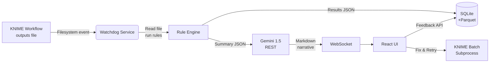

# **DQ Watchdog Agent – Developer Documentation**

A local-first, Gemini-powered data-quality assistant for KNIME-based reporting pipelines
*(v0.1 – July 2025)*

---

## Table of Contents

1. [Purpose & Scope](#1-purpose--scope)
2. [Key Features](#2-key-features)
3. [High-Level Architecture](#3-high-level-architecture)
4. [Technology Stack](#4-technology-stack)
5. [Folder & Module Layout](#5-folder--module-layout)
6. [Data-Quality Rule Framework](#6-data-quality-rule-framework)
7. [Gemini Prompt Templates](#7-gemini-prompt-templates)
8. [KNIME Integration Patterns](#8-knime-integration-patterns)
9. [Local Setup & Installation](#9-local-setup--installation)
10. [Configuration](#10-configuration)
11. [Running & Using the Agent](#11-running--using-the-agent)
12. [Extending the System](#12-extending-the-system)
13. [Operational Timeline](#13-operational-timeline)
14. [Troubleshooting & FAQ](#14-troubleshooting--faq)
15. [Contributing & Coding Guidelines](#15-contributing--coding-guidelines)
16. [Appendices](#16-appendices)

---

## 1 · Purpose & Scope

The **DQ Watchdog** agent automatically validates fresh output files produced by your nightly **KNIME** workflows, explains any data-quality breaches in plain English, and offers remediation actions—all without leaving your local machine.
It is intentionally cloud-free: the only external call is to **Vertex AI Gemini** for narrative generation.

---

## 2 · Key Features

| Category                 | Capability                                                                                                         |
| ------------------------ | ------------------------------------------------------------------------------------------------------------------ |
| **Autodiscovery**        | Watches a configurable folder for new/updated files (CSV, Parquet, Excel, or Google-Sheets exports).               |
| **Deterministic checks** | Runs modular Python rules (missing %, negative values, duplicate keys, percentile bounds, max-date guard, etc.).   |
| **LLM explanations**     | Converts structured rule failures into concise, context-aware narratives plus code snippets for fixes.             |
| **Interactive UI**       | React web chat streams live status, error cards, and one-click “Fix & Retry” buttons.                              |
| **Feedback loop**        | Stores your thumbs-up/down ratings in SQLite; similar issues reuse approved wording via local vector search.       |
| **Local-only runtime**   | DuckDB for fast SQL-on-files, Chroma/FAISS for embeddings, no cloud storage or network egress (aside from Gemini). |

---

## 3 · High-Level Architecture



*All components except Gemini live inside a single Docker Compose network.*

---

## 4 · Technology Stack

| Layer          | Library / Tool                  | Version      |
| -------------- | ------------------------------- | ------------ |
| Runtime        | Python                          | 3.12.x       |
| API            | FastAPI + Uvicorn               | ^0.110       |
| File watcher   | watchdog                        | ^4.0         |
| Data wrangling | pandas\[pyarrow], duckdb        | ^2.2, ^0.10  |
| Rule schema    | pandera                         | ^0.17        |
| LLM client     | google-generativeai             | latest       |
| Local memory   | SQLite (via SQLAlchemy)         | ^2.0         |
| Vector store   | Chroma (DuckDB mode) *optional* | ^0.4         |
| Front-end      | React 18 + Vite                 | ^18.x / ^5   |
| State channel  | WebSocket (FastAPI)             | built-in     |
| Packaging      | poetry + Docker Compose         | ^1.8 / ^2.26 |

---

## 5 · Folder & Module Layout

```
dq_watchdog/
├── backend/
│   ├── main.py            # FastAPI entry-point
│   ├── config.py          # Env & settings
│   ├── watcher.py         # Watchdog wrapper
│   ├── rules/             # All DQ rule functions
│   ├── llm/               # Gemini helpers & prompt templates
│   ├── db/                # SQLite models & Chroma init
│   ├── services/          # business-logic modules
│   └── tests/
├── frontend/
│   ├── src/
│   │   ├── App.tsx        # Chat + dashboard
│   │   ├── components/
│   │   └── hooks/
│   └── vite.config.ts
├── docker-compose.yml
├── pyproject.toml
└── README.md
```

---

## 6 · Data-Quality Rule Framework

1. **Rule signature**

   ```python
   def check_negative_ga(df: pd.DataFrame) -> RuleResult:
       """Fail if any GA-related column contains negative values."""
   ```
2. **`RuleResult` dataclass**

   ```python
   @dataclass
   class RuleResult:
       id: str
       severity: Literal["error","warning"]
       passed: bool
       offending_rows: list[int] = field(default_factory=list)
       metric_value: float | dict | None = None
       message: str = ""
   ```
3. **Registration**
   Each function auto-registers via a decorator into `RULE_REGISTRY`; the engine iterates over the list.
4. **pandera schemas** (optional)
   For declarative rules (dtype, ranges) you can attach a `pandera.DataFrameSchema`; failures convert to `RuleResult`.

---

## 7 · Gemini Prompt Templates

*System prompt (static)*

```
You are a senior data-quality analyst.  
Given a JSON list of rule failures, write a concise, actionable
explanation for a business-intelligence engineer. Use bullet points, include
row counts, and propose a code snippet (SQL or Python) that would fix each issue.
```

*User prompt (rendered)*

```json
{
  "file_name": "kpi_2025-07-12.csv",
  "total_rows": 48291,
  "failures": [
    {
      "id": "negative_ga",
      "severity": "error",
      "offending_rows": 532,
      "metric_value": -1743,
      "message": "Column GA contains negative values."
    },
    ...
  ]
}
```

> **Tip:** keep schema deterministic—Gemini only supplies prose, not logic.

---

## 8 · KNIME Integration Patterns

| Approach                                       | Pros                                            | Cons                                    |
| ---------------------------------------------- | ----------------------------------------------- | --------------------------------------- |
| **Filesystem trigger** *(default)*             | Zero KNIME changes; works on failure files too. | Slight latency (seconds) if many files. |
| **REST callback** (`Call Local REST API` node) | Explicit, no extra events.                      | Edit required in each workflow.         |
| **Post-run batch** (`knime -reset`)            | Enables “Fix & Retry” via CLI                   | Requires KNIME on server PATH.          |

---

## 9 · Local Setup & Installation

```bash
# 1. Clone repo & install dependencies
git clone https://github.com/your-org/dq_watchdog.git
cd dq_watchdog
poetry install

# 2. Front-end
cd frontend
npm install        # first time
npm run build      # production bundle

# 3. Environment variables
cp .env.example .env   # edit GEMINI_API_KEY and WATCH_DIR

# 4. One-shot run
docker compose up --build
# UI → http://localhost:5173   API → http://localhost:8000/docs
```

---

## 10 · Configuration

| Variable          | Default               | Description                                         |
| ----------------- | --------------------- | --------------------------------------------------- |
| `WATCH_DIR`       | `/data/daily`         | Folder the watcher monitors (recursive).            |
| `DB_PATH`         | `./db/dq_watchdog.db` | SQLite file location.                               |
| `PARQUET_DIR`     | `./results`           | Where rule results are written.                     |
| `GEMINI_API_KEY`  | –                     | Vertex AI key with Gemini access.                   |
| `SNIPPET_TIMEOUT` | `5`                   | Seconds allowed for auto-generated fix code to run. |

---

## 11 · Running & Using the Agent

1. **Automatic mode**
   Leave `docker compose` running; each new data-file triggers validation and pushes a card to the UI.
2. **Manual trigger**
   `POST /api/trigger` with JSON payload `{ "path": ".../myfile.csv" }`.
3. **Fix & Retry**
   Click the wrench icon → backend runs KNIME batch command with node reset → watcher re-evaluates when new file appears.
4. **CLI headless**

   ```bash
   poetry run dq_watchdog myfile.csv --explain --open
   ```

---

## 12 · Extending the System

* **Add a rule:** create `rules/check_<name>.py`; decorate with `@register_rule`.
* **Add file types:** extend `services/loader.py` with new mimetype handler.
* **Swap vector store:** Change `CHROMA_PERSIST_DIR` env or comment out if not needed.
* **Alternative UI:** route WebSocket messages to Slack webhook or MS Teams card.

---

## 13 · Operational Timeline

| Phase             | Duration           | Deliverables                             |
| ----------------- | ------------------ | ---------------------------------------- |
| **0 Setup**       | 0.5 day            | Repo, Docker, env config.                |
| **1 Watcher**     | 1 day              | `watcher.py`, unit tests.                |
| **2 Rules**       | 1 day              | Ported rule functions + pandera schemas. |
| **3 Storage**     | 0.5 day            | SQLite models, Parquet writer.           |
| **4 LLM Prompts** | 1 day              | System/user templates, sample outputs.   |
| **5 API Layer**   | 1 day              | FastAPI routes, WebSocket.               |
| **6 UI**          | 2 days             | React chat, error cards, retry button.   |
| **7 QA & Docs**   | 1 day              | Playwright tests, this documentation.    |
| **Total**         | **7 working days** | Feature-complete MVP.                    |

---

## 14 · Troubleshooting & FAQ

<details><summary>Gemini returns 401</summary>

*Check `GEMINI_API_KEY` and whether the key has access to the **Generative Language API** role.*

</details>

<details><summary>Watcher misses files</summary>

*Ensure OS inotify limit isn’t reached (`fs.inotify.max_user_watches`). Increase with `sudo sysctl -w ...`.*

</details>

<details><summary>KNIME batch command fails</summary>

*Verify `knime` is on PATH or set `KNIME_HOME` in `.env`. Review `backend/services/rerun.py` for command string.*

</details>

---

## 15 · Contributing & Coding Guidelines

* **Branch naming** – `feature/<short-desc>`, `fix/<issue>`.
* **Commits** – conventional-commits style (`feat:`, `fix:`, `docs:`).
* **Testing** – new rule ⇒ add a `tests/test_<rule>.py` case with synthetic data.
* **Doc blocks** – Google-style docstrings; mypy type hints mandatory (`strict = True`).
* **Pre-commit** – `ruff`, `black`, `isort`, and `pytest -q` must pass.

---

## 16 · Appendices

### A. KNIME Batch Cheat-Sheet

```bash
knime -nosplash \
  -application org.knime.product.KNIME_BATCH_APPLICATION \
  -workflowFile="/workflows/Daily_KPI" \
  --reset 00cf2e23-d9dd-4720-bbbb-e3c928 \
  -consoleLog
```

### B. Example `.env`

```
GEMINI_API_KEY=ya29.a0AfB_by...
WATCH_DIR=/opt/knime/output
DB_PATH=./db/dq_watchdog.db
PARQUET_DIR=./results
SNIPPET_TIMEOUT=5
```

### C. Sample Rule Failure JSON

```json
[
  {
    "id": "null_pct_gt_5",
    "severity": "warning",
    "passed": false,
    "metric_value": 7.3,
    "offending_rows": [12, 89, 7431],
    "message": "Null percentage (7.3%) exceeds threshold (5%)."
  }
]
```

---

**You’re set!**
Clone the repo, drop in your DQ rule functions, point `WATCH_DIR` at your KNIME output, and fire up `docker compose`. Within a week you’ll have a fully-functional, locally-hosted data-quality sidekick that explains issues before your morning coffee. Happy hacking!
