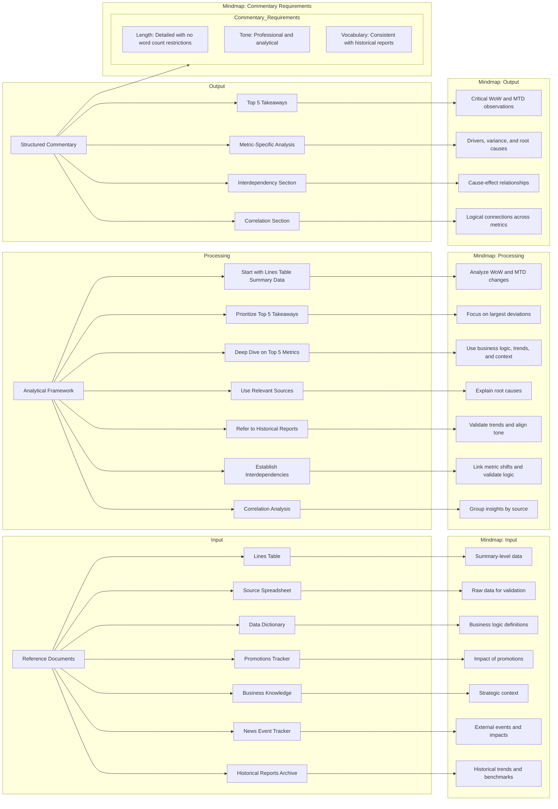

```mermaid
%% Enhanced Prompt Flow with Mindmap
flowchart LR
    %% Input Section
    subgraph Input[Input]
        A1[Reference Documents]
        A1a[Lines Table]
        A1b[Source Spreadsheet]
        A1c[Data Dictionary]
        A1d[Promotions Tracker]
        A1e[Business Knowledge]
        A1f[News Event Tracker]
        A1g[Historical Reports Archive]
    end

    subgraph Input_Mindmap[Mindmap: Input]
        A1 --> A1a --> A1a1["Summary-level data"]
        A1 --> A1b --> A1b1["Raw data for validation"]
        A1 --> A1c --> A1c1["Business logic definitions"]
        A1 --> A1d --> A1d1["Impact of promotions"]
        A1 --> A1e --> A1e1["Strategic context"]
        A1 --> A1f --> A1f1["External events and impacts"]
        A1 --> A1g --> A1g1["Historical trends and benchmarks"]
    end

    %% Processing Section
    subgraph Processing[Processing]
        A2[Analytical Framework]
        A2a[Start with Lines Table Summary Data]
        A2b[Prioritize Top 5 Takeaways]
        A2c[Deep Dive on Top 5 Metrics]
        A2d[Use Relevant Sources]
        A2e[Refer to Historical Reports]
        A2f[Establish Interdependencies]
        A2g[Correlation Analysis]
    end

    subgraph Processing_Mindmap[Mindmap: Processing]
        A2 --> A2a --> A2a1["Analyze WoW and MTD changes"]
        A2 --> A2b --> A2b1["Focus on largest deviations"]
        A2 --> A2c --> A2c1["Use business logic, trends, and context"]
        A2 --> A2d --> A2d1["Explain root causes"]
        A2 --> A2e --> A2e1["Validate trends and align tone"]
        A2 --> A2f --> A2f1["Link metric shifts and validate logic"]
        A2 --> A2g --> A2g1["Group insights by source"]
    end

    %% Output Section
    subgraph Output[Output]
        A3[Structured Commentary]
        A3a[Top 5 Takeaways]
        A3b[Metric-Specific Analysis]
        A3c[Interdependency Section]
        A3d[Correlation Section]
    end

    subgraph Output_Mindmap[Mindmap: Output]
        A3 --> A3a --> A3a1["Critical WoW and MTD observations"]
        A3 --> A3b --> A3b1["Drivers, variance, and root causes"]
        A3 --> A3c --> A3c1["Cause-effect relationships"]
        A3 --> A3d --> A3d1["Logical connections across metrics"]
    end

    %% Commentary Requirements
    subgraph Commentary_Requirements
        CR1[Length: Detailed with no word count restrictions]
        CR2[Tone: Professional and analytical]
        CR3[Vocabulary: Consistent with historical reports]
    end

    subgraph Commentary_Requirements_Mindmap[Mindmap: Commentary Requirements]
        A3 --> Commentary_Requirements
    end
```
